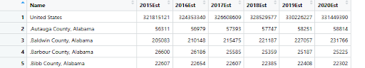

```{r setup, include=FALSE}
knitr::opts_chunk$set(
  collapse = TRUE,   
  message = FALSE
)
```


```{r echo=FALSE}
library(tidyverse)
library(here)
library(dplyr)
library(readxl)
library(viridis)

chronic_diseases <- read.csv(here("data/U.S._Chronic_Disease_Indicators.csv"))
air_quality_2015 <- read.csv(here("data/annual_aqi_by_county_2015.csv"))
air_quality_2016 <- read.csv(here("data/annual_aqi_by_county_2016.csv"))
air_quality_2017 <- read.csv(here("data/annual_aqi_by_county_2017.csv"))
air_quality_2018 <- read.csv(here("data/annual_aqi_by_county_2018.csv"))
air_quality_2019 <- read.csv(here("data/annual_aqi_by_county_2019.csv"))
air_quality_2020 <- read.csv(here("data/annual_aqi_by_county_2020.csv"))
air_quality_2021 <- read.csv(here("data/annual_aqi_by_county_2021.csv"))

population_data <- read_excel(here("data/co-est2020int-pop.xlsx"), skip=3)


```


## Topics: Air quality, Pollution, Human Illness

This project aims to investigate the relationship between pollution and chronic illnesses in the United States. We chose to focus on air quality rates to measure air pollution. We also chose to focus on respiratory illnesses and cancers, since they are most likely to be affected by air quality compared to other forms of chronic illnesses. We chose to research this topic since pollution is a very prominent problem that the United States is facing, manifesting in ways like increasing temperatures and deadly ailments.


## Project Research Question

What is the strength of the relationship between state-level ozone pollution and AQI levels with chronic respiratory illness rates?

#### Important Definitions
- **Urban**: In close proximity to a city
- **AQI**: Air Quality Index: A tool to report on air pollution levels, communicating potential health risks with a single number. The higher the AQI, the worse the air quality. 

## Followup Questions

- Does living closer to cities have an effect on the risk of chronic respiratory illness?
- Does living in areas with higher populations, have an effect on the risk of chronic respiratory illness?
- What are some of the most dangerous counties to live in based on rates of chronic respiratory illness?
- How has air quality changed over time and how has this affected chronic illness rates?
- Do the levels of ozone in the atmosphere correlate with rates of chronic respiratory illnesses? 


## Data and Data Source

### Data on Chronic Disease Infection

[Link to Dataset](https://catalog.data.gov/dataset/u-s-chronic-disease-indicators)

#### Here is a snippet of our data, specifically the way that the values are measured.


#### Next is a snippet of the metrics the we plan to use to sort our data; i.e. the location where the data is recorded. We plan to use the **LocationDesc** field to organize the chronic diseases data, as this field's structure matches up with the State field of our other data set.


### Chronic Disease Data Validity

The data is collected by Centers for Disease Control and Prevention’s Division of Population Health but then processed and standardized by CDC before publication. The result is a compiled data set that covers the state and national level chronic disease indicators, suitable for public use. If you take a look at the data, you'll see that many of the fields are scattered with blank values. For this reason, we sort our data based on the values that do exist. Thus, avoiding the occasional blank value.

This CDC data set was developed using a cross-cutting set of 115 indicators developed by consensus among the CDC, the Council of State and Territorial Epidemiologists, and the national Association of Chronic Disease Directors. Given that the data was collected and developed under the supervision of multiple professional organizations, the probability of notable bias is likely low. Overall, this data set is highly reliable in terms of minimizing bias, although some potential for bias in the original data collection still exists, even with large sample sizes.

### Data on National Air Quality Metrics

[Link to Dataset](https://aqs.epa.gov/aqsweb/airdata/download_files.html)

#### About the data

The link provided directs you to a webpage with a number of downloadable csv files. For our research, we are using the the Annual Summary Data, specifically the annual AQI data by **county** for the years 2015-2021. So, we are using 7 different CSV files, but they are all the same structure, with each file representing a different year.

#### Here are some snippets for the air quality metrics.


As you can see, each entry has a state, county, and year, allowing us to isolate big cities in the US. In terms of the data collection, we can see how many days were deemed healthy, unhealthy, unhealthy for sensitive groups, hazardous, etc. First, we will sort by state, as that's the data field that both of the data sets share in common. Once we've sorted the air quality data by states, we can compare the AQI measurements and the day totals, to other states.

### Air Quality Data Validity

The air quality data that we're using comes from the Environmental Protection Agency's (EPA) Air Quality System (AQS). EPA receives their their data from data collection agencies and incorporates standardized methods, consistent pollutant definitions, and established regulatory criteria. After the data is reported to EPA, EPA calculates several types of federally aggregated data, including the annual air quality data set that we are analyzing. The data that they receive has already been preprocessed, meaning that the data has already been cleaned with. Part of this preprocessing  remove any missing values, and fill empty pollution scores with the value 0.

Although the EPA’s AQS dataset follows standardized monitoring protocols and federally defined procedures, there is still some potential for bias in the underlying measurements. There. is room for some variation between local monitoring practices, differences in equipment, and sampling, among the various data collection agencies. Additionally, outliers in pollution data could be produced based on unexpected events, such as wildfires or dust storms. Overall, the EPA's preprocessing steps work to solve many of the possible bias factors, but bias is still possible.

### Population Data

In addition, we are using generic, United States population census data from [census.gov](https://www.census.gov/data/datasets/time-series/demo/popest/intercensal-2010-2020-counties.html) for measuring population in each county. This screenshot was produced after cleaning the code a few blocks below:



### Population Data Validity

The population data we are using comes from the U.S. Census Bureau’s County Intercensal Estimates for the years 2010–2020. These figures are produced by combining two different data sources: the official decennial census counts and the annual postcensal estimates for each county. The Census Bureau resolves differences between these sources using a standardized methodology, which guarantees that the population totals are consistent across all ten years. Since the intercensal files are generated directly by the Census Bureau and follow well-defined statistical procedures, the dataset is considered highly reliable for analyzing population trends in the United States.

Although the Census Bureau rigorously tries to standardize this data, there is still some room for bias in the population estimates. Some counties may be undercounted or overcounted, despite the verification of birth records, death records, and migration data. This kind of population data can vary from county to county, regardless of the efforts to minimize these inaccuracies. As a result of the nature of population data, there is room for small inaccuracies; however, these inaccuracies should not significantly impact the data analysis that we plan to perform.

#### Next Steps

Now that we've sorted our air quality data we can handle our chronic disease data. Similar to the air quality, we will sort the chronic diseases based on state; this field is called "LocationAbbr" in the chronic diseases data. In order to isolate respiratory illness, we'll sort this data by "Topic," specifying what type of disease the rows represents.

Once we've sorted both data sets as described above, we can answer the question; How strongly does air quality / pollution contribute to risk of chronic respiratory illness?

### Given these datasets, we need to filter the chronic diseases data to figure out which diseases can be labelled as respiratory

#### First, we'll look at all of the possible options for the Topic columns:

```{r}
unique_topics <- unique(chronic_diseases$Topic)
print(unique_topics)
```
#### Based on the given topics, here's a list of which topics can be categorized as respiratory:

#####Definitely respiratory:

- "Asthma"

- "Chronic Obstructive Pulmonary Disease"

##### Could be / need more investigation:

- "Cancer"

- "Tobacco"

- "Sleep"

- "Nutrition, Physical Activity, and Weight Status"

##### Definitely not respiratory:

- "Mental Health"

- "Diabetes"

- "Immunization"

- "Oral Health"

- "Arthritis"

- "Cardiovascular Disease"

- "Disability"

- "Alcohol"

- "Cognitive Health and Caregiving"

- "Maternal Health"

- "Chronic Kidney Disease"

- "Health Status"

- "Social Determinants of Health"

If you look at the list of topics above, some of them are very broad, so to isolate the respiratory diseases, we will need to view all of the possible options for the Question column, within certain topics. After we've investigated our options the Question column, we can sort our disease data to only include respiratory diseases.

Only lung and bronchial cancer would be respiratory
```{r}
chronic_diseases %>%
  filter(Topic == "Cancer") %>%
  pull(Question) %>%
  unique()
```

Rows 1, 2, 4, and 6 are all respiratory issues
```{r}
chronic_diseases %>%
  filter(Topic == "Tobacco") %>%
  pull(Question) %>%
  unique()
```

None of the sleep questions fit a respiratory disease
```{r}
chronic_diseases %>%
  filter(Topic == "Sleep") %>%
  pull(Question) %>%
  unique()
```

Here, row 1, 5 and 10 are all respiratory diseases
```{r}
chronic_diseases %>%
  filter(Topic == "Nutrition, Physical Activity, and Weight Status") %>%
  pull(Question) %>%
  unique()
```

##### Now, we're ready to filter our data.

Since "Asthma" and "Chronic Obstructive Pulmonary Disease" are definitely respiratory, we will include all rows that have those topics. For the topics that were up for investigation, we will only include rows that have questions regarding respiratory issues.
```{r}
respiratory_diseases <- chronic_diseases %>%
  filter(
    Topic %in% c("Asthma", "Cancer", "Tobacco", "Nutrition, Physical Activity, and Weight Status") &
    (
      (Topic == "Cancer" & Question == "Lung and bronchial cancer mortality among all people, underlying cause") |
      (Topic == "Tobacco" & Question %in% c(
        "Quit attempts in the past year among adult current smokers",
        "Current cigarette smoking among adults",
        "Cigarette smoking during pregnancy among women with a recent live birth",
        "Current electronic vapor product use among high school students"
      )) |
      (Topic == "Nutrition, Physical Activity, and Weight Status" & Question %in% c(
        "Children and adolescents aged 6-13 years meeting aerobic physical activity guideline",
        "Met aerobic physical activity guideline among high school students",
        "Met aerobic physical activity guideline for substantial health benefits, adults"
      )) |
      (Topic == "Asthma") |
      (Topic == "Chronic Obstructive Pulmonary Disease")
    )
  )
```


## Proposal Expectations Evaluation 

As we looked further into our data set we decided to filter the chronic illness data by specific illnesses. We chose to look at Asthma, respiratory illnesses, and lung, throat, and breast cancer. We chose these since they would be more likely to be affected by poor air quality. We also noticed that the data on chronic illnesses was sorted by state so we chose to define how urban a state is by population since we would not be able to compare counties that did and did not have major cities within them. We also felt the population of the state was a better measure than the number of major cities within the state because defining a major city would be based on population. We anticipated a positive correlation between the Air Quality Index (AQI) of a state and rates of illnesses. We also anticipated that higher populations of a state would have a positive correlation with AQI. We also decided to investigate the effects of ozone levels further since it is a more specific variable and is directly linked to the burning of fossil fuels by power plants and vehicles.

## Graphed Results

```{r}
 population_data_cleaned <- population_data %>%
  filter(.[[1]] != "United States") %>% 
  select(1, 8:ncol(.)) %>%
  setNames(c("Name", paste0(2015:2020))) %>%
  mutate(
    County = Name %>%
      sub("^\\.", "", .) %>%            # remove leading dot
      sub("\\s*County,.*$", "", .)      # remove ' County, ...'
  )


```

- Population size: Scatter plot with air quality on the y-axis and population on the x-axis

```{r}
  air_quality_all <- bind_rows(
  air_quality_2015,
  air_quality_2016,
  air_quality_2017,
  air_quality_2018,
  air_quality_2019,
  air_quality_2020
)

# Modify population data for easy joining with AQI 
population_long <- population_data_cleaned %>%
  pivot_longer(
    cols = starts_with("20"), # get just the years
    names_to = "Year", 
    values_to = "Population"
  ) %>% 
    mutate(Year = as.integer(Year)) 
  
  
  # Group Air Quality by State
  aqi_county <- air_quality_all %>%
  group_by(County, Year) %>%
  summarise(AQI = mean(Max.AQI, na.rm = TRUE))

  scatter_data <- population_long %>%
  left_join(aqi_county, by = c("County", "Year")) %>% 
    filter(!is.na(AQI) & !is.na(Population))
  
  
  ggplot(scatter_data, aes(x = Population, y = AQI, color = factor(Year))) +
  geom_point(alpha = 0.6) +
  scale_x_continuous(labels = scales::comma) +
  labs(
    title = "County Population vs Average Max AQI (2015-2020)",
    x = "County Population",
    y = "Average Max AQI",
    color = "Year"
  ) 
```
Given this visualization, there is fair support to say that population and AQI are positively correlated.  In addition, we can see how especially in lowly populated areas, the year 2020 resulted in most people staying indoors, leading to less pollution of the air. 


```{r}
  state_lookup <- tibble(
    State = state.name,
    LocationAbbr = state.abb
  )

  aqi_state <- aqi_state %>%
  left_join(state_lookup, by = c("State" = "State")) %>%
  select(LocationAbbr, Year, AQI)
  
  #
  respiratory_state <- respiratory_diseases %>%
  filter(!is.na(DataValue)) %>%
  group_by(LocationAbbr, Year = YearStart) %>%
  summarise(
    DiseaseRate = mean(DataValue, na.rm = TRUE),
  )
  
  scatter_data_2 <- aqi_state %>%
  left_join(respiratory_state, by = c("LocationAbbr", "Year")) %>%
  filter(!is.na(DiseaseRate))
  
  
  ggplot(scatter_data_2, aes(x = AQI, y = DiseaseRate, color = factor(Year))) +
  geom_point(alpha = 0.7, size = 3) +
  labs(
    title = "Correlation of AQI with Respiratory Disease Rates",
    x = "Average Max AQI",
    y = "Respiratory Disease Rate",
    color = "Year"
  ) 
```
Here, we are looking strictly at AQI vs Respiratory disease rates over time.
On average, as expected, lower AQI correlates to higher respiratory disease rates.

In future iterations, this section will be updated to include an assessment of all variables, as in AQI, urbanity, and respiratory disease rates.


## Conclusion

#Summarize your central narrative here. Present the key findings from each follow up question and explain how they collectively address the main research question. Finally, provide a clear and concise conclusion that directly responds to the main research question
After completing our research our initial hypothesis was supported. We found that having a greater population in an area would correlate with higher levels of air pollution and worse air quality which in turn correlates with higher levels of chronic illnesses relating to respiratory issues. 


## Data Dictionary
- AQI- Air Quality Index- The higher the AQI value, the greater the level of air pollution and the greater the health concern, an AQI value of 50 or below represents good air quality, while an AQI value over 300 represents hazardous air quality.
  + Average Max AQI- An average of the daily maximum AQI's for each year.
- Chronic respiratory diseases- Diseases record in the data set that relate to respiratory health, specifically Asthma and Chronic Obstructive Pulmonary Disease.
- Disease Rate- The average number of people with the illness per 100,000 people. 
- Population- The number of people in a certain area. 


### Member Contributions
Theo: Found chronic disease data set and examined how it relates to the air quality data set. Helped refine research question. Along with that, I cleaned the data to decide which rows should be kept and which rows are not considered respiratory. Filtered the data into a new table (respiratory_diseases), after cleaning the original data set.
Rose: Helped define research question as well as come up with follow up questions and how to best graph them. I wrote the Proposal Expectations Evaluation discussing what we worked on as a group. I also adjusted the research questions in response to feedback from the proposal as well as help to focus what parts of the datasets we wanted to use.    
Joseph: PROPOSAL: Developed this file in coordination with team; examined data sources, created and refined research questions. PROGRESS REPORT: Set up population data integration with [readxl].  Cleaned that data and joined with previously created frames to make visualizations (both scatterplots). 


