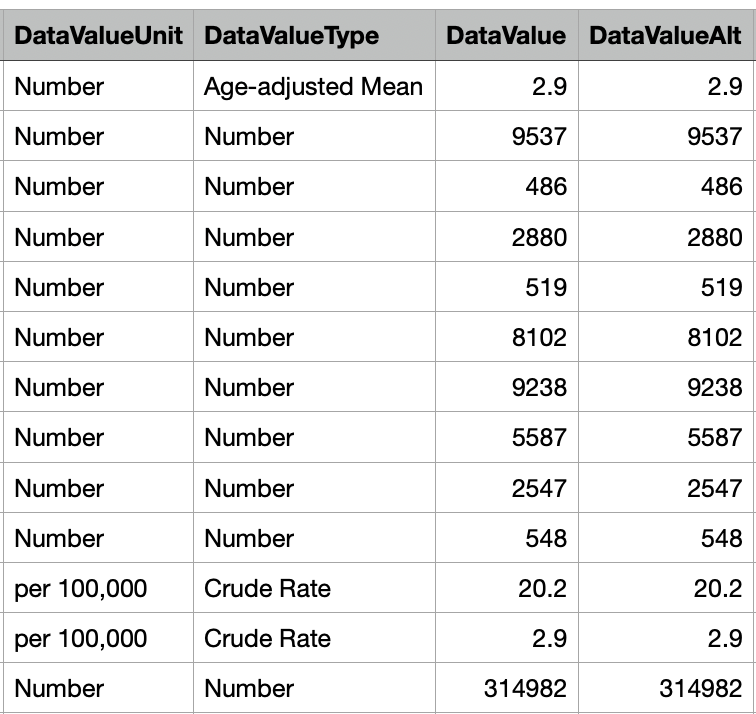
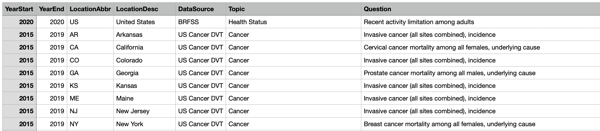
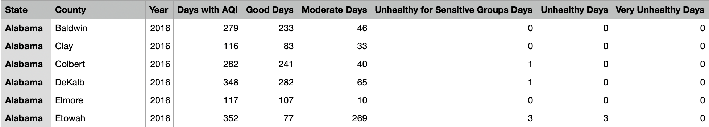

```{r setup, include=FALSE}
knitr::opts_chunk$set(
  collapse = TRUE,   
  message = FALSE
)
```


```{r echo=FALSE}
library(tidyverse)
library(here)

chronic_diseases <- read.csv(here("../U.S._Chronic_Disease_Indicators.csv"))
air_quality_2015 <- read.csv(here("../annual_aqi_by_county_2015.csv"))
air_quality_2016 <- read.csv(here("../annual_aqi_by_county_2016.csv"))
air_quality_2017 <- read.csv(here("../annual_aqi_by_county_2017.csv"))
air_quality_2018 <- read.csv(here("../annual_aqi_by_county_2018.csv"))
air_quality_2019 <- read.csv(here("../annual_aqi_by_county_2019.csv"))
air_quality_2020 <- read.csv(here("../annual_aqi_by_county_2020.csv"))
air_quality_2021 <- read.csv(here("../annual_aqi_by_county_2021.csv"))
```


## Topics: Air quality, Pollution, Human Illness

We wanted to investigate the effects of pollution on chronic illnesses in the United States. We chose to focus on air quality rates to measure air pollution. We also chose to focus on respiratory illnesses and cancers since they would most likely be most affected by air quality compared to other forms of chronic illnesses. 


### Project Research Question

Does air quality have an effect on the risk of chronic respiratory illness?

#### Followup Questions

- Does living closer to cities, in more urban areas, have an effect on the risk of chronic respiratory illness?
- Does living in areas with higher populations, have an effect on the risk of chronic respiratory illness?
- What are some of the most dangerous counties to live in based on rates of chronic respiratory illness?
- How has air quality changed over time and how has it affected chronic illness rates?


### Data and Data Source

#### Data on Chronic Disease Infection

[Link to Dataset](https://catalog.data.gov/dataset/u-s-chronic-disease-indicators)

#### Here is a snippet of our data, specifically the way that the values are measured.



#### Next is a snippet of the metrics the we plan to use to sort our data; i.e. the location where the data is recorded.




#### Data on National Air Quality Metrics

[Link to Dataset](https://aqs.epa.gov/aqsweb/airdata/download_files.html)

### About the dataset

The link provided directs you to a webpage with a number of downloadable csv files. For our research, we are using the the Annual Summary Data, specifically the annual aqi data by county for the years from 2015-2021. So, we are using 7 different csv files, but they are all the same structure, with each file representing a different year. The air quality is measure by AQI (Air Quality Index), which is a tool to report on air pollution levels, communicating potential health risks with a single number. The higher the AQI, the worse the air quality is.

#### Here are some snippets for the air quality metrics.




As you can see, each entry has a state, county, and year, allowing use to isolate big cities in the US. In terms of the data collection, we can see how many days deemed were healthy, unhealthy, unhealthy for sensitive groups, hazardous, etc. First, we will sort by state, as that's the data field that both of the data sets share in common. Once we've sorted the air quality data by states, we can compare the AQI measurements and the day totals, to other states.

Now that we've sorted our air quality data we can handle our chronic disease data. Similar to the air quality, we will sort the chronic diseases based on state; this field is called "LocationAbbr" in the chronic diseases data. In order to isolate respiratory illness, we'll sort this data by "Topic," specifying what type of disease the rows represents.

Once we've sorted both data sets as described above, we can answer the question; How strongly does air quality / pollution contribute to risk of chronic respiratory illness?

#### Given these datasets, we need to filter the chronic diseases data to figure out which diseases can be labelled as respiratory

First, we'll look at all of the possible options for the Topic columns:

```{r}
unique_topics <- unique(chronic_diseases$Topic)
print(unique_topics)
```


```{r}
chronic_diseases %>%
  filter(Topic == "Cancer") %>%
  pull(Question) %>%
  unique()
```


### Proposal Expectations Evaluation 

As we looked further into our data set we decided to filter the chronic illness data by specific illnesses. We chose to look at Asthma, respiratory illnesses, and lung, throat, and breast cancer. We chose these since they would be more likely to be affected by poor air quality. We also noticed that the data on chronic illnesses was sorted by state so we chose to define how urban a state is by population since we would not be able to compare counties that did and did not have major cities within them. We also felt the population of the state was a better measure than the number of major cities within the state because defining a major city would be based on population. We anticipated a positive correlation between the Air Quality Index (AQI) of a state and rates of illnesses. We also anticipated that higher populations of a state would have a positive correlation with AQI. 

### Anticipated Results

- Urban Citizen risk: Categorized bar chart by how urban an area is or how far from major cities
- Population size: Scatter plot with air quality on the y-axis and population on the x-axis
- Most Dangerous Counties: Detailed map where color represents the level of air quality
- Air Quality over time: Line plot with time on the x-axis and air quality on the y- axis


### Member Contributions
Theo: Found chronic disease data set and examined how it relates to the air quality data set. Helped refine research question.
Rose: Helped define research question as well as come up with follow up questions and how to best graph them.     
Joseph: Developed this file in coordination with team; examined data sources, created and refined research questions.


